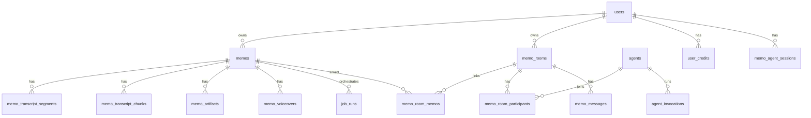

# Voice Memos — Consolidated SQL Schema

This document extracts the **full PostgreSQL schema required to stand up a fresh database** for the `voice-memos` application. It is derived from:

- All checked-in migrations under `voice-memos/supabase/migrations/`
- Application code (`src/`, `agent-worker/`)
- `voice-memos/docs/memo-artifact-schema-reuse.md`
- Historical live-schema snapshots referenced in repo notes (`sql-to-share.sql`, `supabase.sql`)

**Last synthesized:** 2026-05-19

---

## Scope

### Included (voice-memos product)

Everything the app reads or writes today: memos, transcripts, artifacts, jobs, sharing, memo rooms, OpenClaw integration, memo agent chat/credits, and desktop token claims.

### Excluded (shared Supabase project baggage)

The repo root file `supabase.sql` is a **context dump of a large multi-product database** (marketplace agents, workspaces, newsletters, etc.). Those tables are **not** required for a voice-memos-only deployment.

Do **not** confuse:

| Table | In voice-memos? | Notes |
|-------|-----------------|-------|
| `public.agents` (memo-room agents) | Yes | Created in `20260316140000_add_memo_room_agents.sql` |
| `public.agents` (marketplace listings) | No | Exists only in the shared `supabase.sql` dump |

---

## Architecture overview



**Auth model:** Clerk JWT `sub` claim maps to `users.id` (`text`). Most RLS policies use `(auth.jwt() ->> 'sub') = user_id`. Server routes also use the Supabase service role, which bypasses RLS.

**Storage (not SQL tables):** Supabase Storage bucket `voice-memos` for audio uploads and voiceover files.

---

## Prerequisites

```sql
-- Required extensions (Supabase projects usually have these pre-enabled)
create extension if not exists "pgcrypto";
create extension if not exists "uuid-ossp";
```

---

## Consolidated DDL (fresh install)

Run sections **in order**. This is the merged end-state of all migrations plus base tables that predate the migration folder.

### 1. Core identity

```sql
-- Minimal user row for Clerk IDs. The app upserts { id } on first use.
create table public.users (
  id text primary key
);
```

### 2. Memos (base table + share + transcript status)

The original `memos` table predates checked-in migrations. This definition matches live usage in API routes and share resolution.

```sql
create table public.memos (
  id uuid primary key default gen_random_uuid(),
  user_id text references public.users(id) on delete cascade,
  title text not null,
  transcript text,
  audio_url text not null default '',
  duration double precision,              -- seconds; app treats as numeric
  transcript_status text not null default 'complete'
    check (transcript_status in ('processing', 'complete', 'failed')),
  stream_session_id text,                 -- live recording session (optional)
  share_token text,
  shared_at timestamptz,
  revoked_at timestamptz,
  is_shareable boolean not null default true,
  share_expires_at timestamptz,
  expires_at timestamptz,                 -- legacy alias; prefer share_expires_at
  created_at timestamptz not null default now()
);

create unique index if not exists memos_share_token_unique_idx
  on public.memos (share_token)
  where share_token is not null;

create index if not exists memos_user_created_idx
  on public.memos (user_id, created_at desc);
```

Optional share-token format guard (recommended in prior project notes):

```sql
alter table public.memos
  add constraint memos_share_token_format_chk
  check (share_token is null or share_token ~ '^[A-Za-z0-9_-]{8,128}$');
```

### 3. Background jobs

```sql
create table public.job_runs (
  id uuid primary key default gen_random_uuid(),
  user_id text not null references public.users(id) on delete cascade,
  job_type text not null,
  entity_type text not null,
  entity_id uuid not null,
  status text not null default 'pending'
    check (status in ('pending', 'running', 'succeeded', 'failed')),
  params jsonb,
  result jsonb,
  error text,
  started_at timestamptz,
  finished_at timestamptz,
  created_at timestamptz not null default now()
);

create unique index if not exists job_runs_one_active_per_entity_type
  on public.job_runs (entity_id, entity_type, job_type)
  where status in ('pending', 'running');
```

**Job types used by the app**

| `job_type` | Purpose |
|------------|---------|
| `memo_chunk_compact_live` | Compact live transcript segments into chunks |
| `memo_summary_live` | Rolling live summary artifact |
| `memo_outline_live` | Live outline artifact |
| `memo_artifact_final` | Final-pass artifacts after transcription |
| `memo_agent_chat` | Memo agent worker queue |

### 4. Desktop token claims

```sql
create table public.desktop_token_claims (
  code text primary key,
  token text not null,
  token_expires_at timestamptz not null,
  claim_expires_at timestamptz not null
);

create or replace function public.claim_desktop_token(p_code text)
returns table(token text, token_expires_at timestamptz)
language sql
as $$
  delete from public.desktop_token_claims
  where code = p_code
    and claim_expires_at > now()
  returning token, token_expires_at;
$$;
```

### 5. Transcript segments, chunks, artifacts

```sql
create table public.memo_transcript_segments (
  id bigserial primary key,
  memo_id uuid not null references public.memos(id) on delete cascade,
  user_id text not null references public.users(id) on delete cascade,
  segment_index integer not null,
  start_ms integer not null,
  end_ms integer not null,
  text text not null,
  source text not null default 'final'
    check (source in ('live', 'final')),
  created_at timestamptz not null default now(),
  constraint memo_transcript_segments_unique
    unique (memo_id, segment_index, source),
  constraint memo_transcript_segments_valid_time
    check (start_ms >= 0 and end_ms >= start_ms)
);

create index memo_transcript_segments_memo_source_idx
  on public.memo_transcript_segments (memo_id, source, segment_index);

create index memo_transcript_segments_memo_source_time_idx
  on public.memo_transcript_segments (memo_id, source, start_ms);

create index memo_transcript_segments_lookup
  on public.memo_transcript_segments (memo_id, segment_index);

alter table public.memo_transcript_segments enable row level security;

create policy "users_own_segments"
  on public.memo_transcript_segments
  for all
  using ((auth.jwt() ->> 'sub') = user_id)
  with check ((auth.jwt() ->> 'sub') = user_id);

-- ---------------------------------------------------------------------------

create table public.memo_transcript_chunks (
  id bigserial primary key,
  memo_id uuid not null references public.memos(id) on delete cascade,
  user_id text not null references public.users(id) on delete cascade,
  source text not null check (source in ('live', 'final')),
  chunk_index integer not null,
  segment_start_index integer not null,
  segment_end_index integer not null,
  start_ms integer not null,
  end_ms integer not null,
  text text not null,
  token_estimate integer,
  status text not null default 'ready'
    check (status in ('ready', 'superseded')),
  created_at timestamptz not null default now(),
  updated_at timestamptz not null default now(),
  unique (memo_id, source, chunk_index)
);

create index memo_transcript_chunks_memo_source_idx
  on public.memo_transcript_chunks (memo_id, source, chunk_index);

alter table public.memo_transcript_chunks enable row level security;

create policy users_own_chunks on public.memo_transcript_chunks
  for all
  using ((auth.jwt() ->> 'sub') = user_id)
  with check ((auth.jwt() ->> 'sub') = user_id);

-- ---------------------------------------------------------------------------

create table public.memo_artifacts (
  id bigserial primary key,
  memo_id uuid not null references public.memos(id) on delete cascade,
  user_id text not null references public.users(id) on delete cascade,
  source text not null check (source in ('live', 'final')),
  artifact_type text not null check (
    artifact_type in (
      'rolling_summary',
      'outline',
      'title_candidates',
      'title',
      'key_topics',
      'action_items'
    )
  ),
  version integer not null default 1,
  status text not null default 'ready'
    check (status in ('ready', 'superseded', 'failed')),
  based_on_chunk_start integer,
  based_on_chunk_end integer,
  payload jsonb not null,
  created_at timestamptz not null default now(),
  updated_at timestamptz not null default now()
);

create unique index memo_artifacts_one_ready_per_type
  on public.memo_artifacts (memo_id, source, artifact_type)
  where (status = 'ready');

create index memo_artifacts_memo_source_type_idx
  on public.memo_artifacts (memo_id, source, artifact_type, status);

alter table public.memo_artifacts enable row level security;

create policy users_own_artifacts on public.memo_artifacts
  for all
  using ((auth.jwt() ->> 'sub') = user_id)
  with check ((auth.jwt() ->> 'sub') = user_id);

-- Job claim RPC used by transcribe + artifact pipeline
create or replace function public.claim_pending_memo_job(p_memo_id uuid)
returns setof public.job_runs
language sql
security definer
set search_path = public
as $$
  update public.job_runs
  set status = 'running',
      started_at = now()
  where id = (
    select id
    from public.job_runs
    where entity_id = p_memo_id
      and entity_type = 'memo'
      and status = 'pending'
    order by created_at
    limit 1
    for update skip locked
  )
  returning *;
$$;
```

### 6. Voiceovers

```sql
create table public.memo_voiceovers (
  id uuid primary key default gen_random_uuid(),
  memo_id uuid not null references public.memos(id) on delete cascade,
  user_id text not null references public.users(id) on delete cascade,
  voice_id text not null,
  audio_url text,
  storage_path text,
  content_type text,
  status text not null default 'processing'
    check (status in ('processing', 'ready')),
  created_at timestamptz not null default now(),
  updated_at timestamptz not null default now(),
  unique (memo_id, voice_id)
);

create index memo_voiceovers_user_id_idx on public.memo_voiceovers (user_id);
create index memo_voiceovers_memo_id_idx on public.memo_voiceovers (memo_id);

alter table public.memo_voiceovers enable row level security;

create policy "memo_voiceovers_select_own"
  on public.memo_voiceovers for select
  using ((auth.jwt() ->> 'sub') = user_id);

create policy "memo_voiceovers_insert_own"
  on public.memo_voiceovers for insert
  with check ((auth.jwt() ->> 'sub') = user_id);

create policy "memo_voiceovers_update_own"
  on public.memo_voiceovers for update
  using ((auth.jwt() ->> 'sub') = user_id)
  with check ((auth.jwt() ->> 'sub') = user_id);

create policy "memo_voiceovers_delete_own"
  on public.memo_voiceovers for delete
  using ((auth.jwt() ->> 'sub') = user_id);
```

### 7. Memo rooms, agents, messages

```sql
create table public.memo_rooms (
  id uuid primary key default gen_random_uuid(),
  owner_user_id text not null references public.users(id) on delete cascade,
  title text not null,
  description text,
  created_at timestamptz not null default now()
);

create index memo_rooms_owner_created_idx
  on public.memo_rooms (owner_user_id, created_at desc);

create table public.memo_room_memos (
  memo_room_id uuid not null references public.memo_rooms(id) on delete cascade,
  memo_id uuid not null references public.memos(id) on delete cascade,
  created_at timestamptz not null default now(),
  primary key (memo_room_id, memo_id)
);

create index memo_room_memos_memo_idx
  on public.memo_room_memos (memo_id, memo_room_id);

-- One canonical room per memo
create unique index memo_room_memos_memo_unique
  on public.memo_room_memos (memo_id);

-- ---------------------------------------------------------------------------

create table public.agents (
  id uuid primary key default gen_random_uuid(),
  owner_user_id text not null references public.users(id) on delete cascade,
  name text not null,
  description text,
  status text not null default 'active'
    check (status in ('active', 'disabled')),
  openclaw_external_id text,
  openclaw_display_name text,
  openclaw_context text,
  created_at timestamptz not null default now(),
  updated_at timestamptz not null default now()
);

create index agents_owner_created_idx
  on public.agents (owner_user_id, created_at desc);

create unique index agents_openclaw_external_id_owner_idx
  on public.agents (owner_user_id, openclaw_external_id)
  where openclaw_external_id is not null;

-- ---------------------------------------------------------------------------

create table public.memo_room_participants (
  id uuid primary key default gen_random_uuid(),
  memo_room_id uuid not null references public.memo_rooms(id) on delete cascade,
  participant_type text not null
    check (participant_type in ('human', 'agent', 'system')),
  user_id text references public.users(id) on delete cascade,
  agent_id uuid references public.agents(id) on delete cascade,
  system_key text,
  role text not null
    check (role in ('owner', 'member', 'guest', 'observer')),
  capability text not null
    check (capability in ('read_only', 'comment_only', 'full_participation')),
  default_visibility text not null
    check (default_visibility in ('public', 'owner_only', 'restricted')),
  status text not null default 'active'
    check (status in ('active', 'removed')),
  invited_by_user_id text references public.users(id) on delete set null,
  created_at timestamptz not null default now(),
  removed_at timestamptz,
  constraint memo_room_participants_identity_check check (
    (participant_type = 'human' and user_id is not null and agent_id is null and system_key is null)
    or (participant_type = 'agent' and user_id is null and agent_id is not null and system_key is null)
    or (participant_type = 'system' and user_id is null and agent_id is null and system_key is not null)
  )
);

create unique index memo_room_participants_room_user_unique
  on public.memo_room_participants (memo_room_id, user_id)
  where user_id is not null;

create unique index memo_room_participants_room_agent_unique
  on public.memo_room_participants (memo_room_id, agent_id)
  where agent_id is not null;

create unique index memo_room_participants_room_system_unique
  on public.memo_room_participants (memo_room_id, system_key)
  where system_key is not null;

create index memo_room_participants_room_status_idx
  on public.memo_room_participants (memo_room_id, status, created_at);

create index memo_room_participants_room_status_identity_idx
  on public.memo_room_participants (memo_room_id, status, id);

-- ---------------------------------------------------------------------------

create table public.memo_messages (
  id uuid primary key,
  memo_room_id uuid not null references public.memo_rooms(id) on delete cascade,
  memo_id uuid not null references public.memos(id) on delete cascade,
  author_participant_id uuid not null references public.memo_room_participants(id) on delete cascade,
  content text not null,
  visibility text not null
    check (visibility in ('public', 'owner_only', 'restricted')),
  restricted_participant_ids uuid[],
  reply_to_message_id uuid references public.memo_messages(id) on delete cascade,
  root_message_id uuid not null references public.memo_messages(id) on delete cascade,
  anchor_start_ms integer,
  anchor_end_ms integer,
  anchor_segment_ids bigint[],
  created_at timestamptz not null default now(),
  constraint memo_messages_anchor_bounds_check check (
    (anchor_start_ms is null and anchor_end_ms is null)
    or (anchor_start_ms is not null and anchor_end_ms is not null
        and anchor_start_ms >= 0 and anchor_end_ms > anchor_start_ms)
  ),
  constraint memo_messages_restricted_scope_check check (
    (visibility = 'restricted' and coalesce(array_length(restricted_participant_ids, 1), 0) > 0)
    or (visibility <> 'restricted' and coalesce(array_length(restricted_participant_ids, 1), 0) = 0)
  ),
  constraint memo_messages_room_memo_fkey
    foreign key (memo_room_id, memo_id)
    references public.memo_room_memos (memo_room_id, memo_id)
    on delete cascade
);

create index memo_messages_room_created_idx
  on public.memo_messages (memo_room_id, created_at desc);

create index memo_messages_root_idx on public.memo_messages (root_message_id);
create index memo_messages_reply_idx on public.memo_messages (reply_to_message_id);

-- ---------------------------------------------------------------------------

create table public.agent_room_state (
  id uuid primary key default gen_random_uuid(),
  agent_id uuid not null references public.agents(id) on delete cascade,
  memo_room_id uuid not null references public.memo_rooms(id) on delete cascade,
  last_seen_message_id uuid references public.memo_messages(id) on delete set null,
  last_seen_transcript_segment_id bigint references public.memo_transcript_segments(id) on delete set null,
  last_processed_invocation_id uuid,
  default_visibility text not null default 'owner_only'
    check (default_visibility in ('public', 'owner_only', 'restricted')),
  created_at timestamptz not null default now(),
  updated_at timestamptz not null default now(),
  unique (agent_id, memo_room_id)
);

create index agent_room_state_room_idx
  on public.agent_room_state (memo_room_id, agent_id);

create table public.agent_invocations (
  id uuid primary key default gen_random_uuid(),
  agent_id uuid not null references public.agents(id) on delete cascade,
  memo_room_id uuid not null references public.memo_rooms(id) on delete cascade,
  memo_id uuid not null references public.memos(id) on delete cascade,
  request_message_id uuid not null references public.memo_messages(id) on delete cascade,
  response_message_id uuid references public.memo_messages(id) on delete set null,
  invoked_by_user_id text not null references public.users(id) on delete cascade,
  status text not null default 'pending'
    check (status in ('pending', 'processing', 'completed', 'failed')),
  failure_reason text,
  anchor_start_ms integer,
  anchor_end_ms integer,
  anchor_segment_ids bigint[],
  created_at timestamptz not null default now(),
  updated_at timestamptz not null default now(),
  completed_at timestamptz,
  constraint agent_invocations_unique_request unique (agent_id, request_message_id),
  constraint agent_invocations_room_memo_fkey
    foreign key (memo_room_id, memo_id)
    references public.memo_room_memos (memo_room_id, memo_id)
    on delete cascade,
  constraint agent_invocations_anchor_bounds_check check (
    (anchor_start_ms is null and anchor_end_ms is null)
    or (anchor_start_ms is not null and anchor_end_ms is not null
        and anchor_start_ms >= 0 and anchor_end_ms > anchor_start_ms)
  )
);

create index agent_invocations_agent_status_idx
  on public.agent_invocations (agent_id, status, created_at desc);

create index agent_invocations_room_created_idx
  on public.agent_invocations (memo_room_id, created_at desc);

alter table public.agent_room_state
  add constraint agent_room_state_last_processed_invocation_id_fkey
    foreign key (last_processed_invocation_id)
    references public.agent_invocations(id)
    on delete set null;

-- ---------------------------------------------------------------------------

create table public.message_reactions (
  id uuid primary key default gen_random_uuid(),
  message_id uuid not null references public.memo_messages(id) on delete cascade,
  user_id text not null references public.users(id) on delete cascade,
  reaction_type text not null,
  created_at timestamptz not null default now(),
  unique (message_id, user_id, reaction_type)
);

create index message_reactions_message_idx
  on public.message_reactions (message_id, created_at desc);

-- RLS enabled in migrations; API uses service role today.
alter table public.memo_rooms enable row level security;
alter table public.memo_room_memos enable row level security;
alter table public.memo_room_participants enable row level security;
alter table public.memo_messages enable row level security;
alter table public.agents enable row level security;
alter table public.agent_room_state enable row level security;
alter table public.agent_invocations enable row level security;
alter table public.message_reactions enable row level security;
```

### 8. OpenClaw integration

```sql
create table public.openclaw_invite_nonces (
  id uuid primary key default gen_random_uuid(),
  share_ref text not null,
  owner_user_id text not null references public.users(id) on delete cascade,
  nonce text not null unique,
  status text not null default 'active'
    check (status in ('active', 'consumed', 'expired')),
  expires_at timestamptz not null,
  created_at timestamptz not null default now(),
  consumed_at timestamptz
);

create index openclaw_invite_nonces_share_ref_idx on public.openclaw_invite_nonces (share_ref);
create index openclaw_invite_nonces_nonce_idx
  on public.openclaw_invite_nonces (nonce) where status = 'active';

create table public.openclaw_claim_requests (
  id uuid primary key default gen_random_uuid(),
  share_ref text not null,
  memo_id uuid not null references public.memos(id) on delete cascade,
  owner_user_id text not null references public.users(id) on delete cascade,
  openclaw_external_id text not null,
  openclaw_display_name text,
  openclaw_context text,
  status text not null default 'pending'
    check (status in ('pending', 'claimed', 'rejected')),
  agent_id uuid references public.agents(id),
  created_at timestamptz not null default now(),
  claimed_at timestamptz
);

create unique index openclaw_claim_requests_share_pending_idx
  on public.openclaw_claim_requests (share_ref) where status = 'pending';

create index openclaw_claim_requests_external_id_idx
  on public.openclaw_claim_requests (openclaw_external_id);

create or replace function public.claim_openclaw_invite_nonce(
  p_share_ref text,
  p_memo_id uuid,
  p_owner_user_id text,
  p_openclaw_external_id text,
  p_openclaw_display_name text,
  p_openclaw_context text,
  p_nonce text
)
returns setof public.openclaw_claim_requests
language plpgsql
as $$
declare
  consumed_nonce public.openclaw_invite_nonces%rowtype;
  inserted_claim public.openclaw_claim_requests%rowtype;
begin
  update public.openclaw_invite_nonces
    set status = 'consumed', consumed_at = now()
  where nonce = p_nonce
    and share_ref = p_share_ref
    and owner_user_id = p_owner_user_id
    and status = 'active'
    and expires_at > now()
  returning * into consumed_nonce;

  if not found then return; end if;

  insert into public.openclaw_claim_requests (
    share_ref, memo_id, owner_user_id,
    openclaw_external_id, openclaw_display_name, openclaw_context, status
  ) values (
    p_share_ref, p_memo_id, p_owner_user_id,
    p_openclaw_external_id, p_openclaw_display_name, p_openclaw_context, 'pending'
  )
  returning * into inserted_claim;

  return next inserted_claim;
end;
$$;

-- Registration + runtime (final versions after rotate patch)
create table public.openclaw_registration_tokens (
  id uuid primary key default gen_random_uuid(),
  token_hash text not null unique,
  owner_user_id text not null references public.users(id) on delete cascade,
  status text not null default 'active'
    check (status in ('active', 'consumed', 'revoked')),
  expires_at timestamptz not null,
  created_at timestamptz not null default now(),
  consumed_at timestamptz
);

create unique index openclaw_registration_tokens_owner_active_idx
  on public.openclaw_registration_tokens (owner_user_id) where status = 'active';

create table public.openclaw_runtimes (
  id uuid primary key default gen_random_uuid(),
  openclaw_external_id text not null unique,
  secret_hash text not null,
  display_name text,
  owner_user_id text not null references public.users(id) on delete cascade,
  status text not null default 'active'
    check (status in ('active', 'revoked')),
  created_at timestamptz not null default now()
);

create unique index openclaw_runtimes_owner_active_idx
  on public.openclaw_runtimes (owner_user_id) where status = 'active';

create table public.openclaw_register_rate_limits (
  rate_limit_key text primary key,
  attempt_count integer not null check (attempt_count >= 0),
  window_started_at timestamptz not null,
  last_attempt_at timestamptz not null default now()
);

create index openclaw_register_rate_limits_last_attempt_at_idx
  on public.openclaw_register_rate_limits (last_attempt_at);

-- See migration 20260319110000 + 20260319120000 for full RPC bodies:
--   issue_openclaw_registration_token
--   register_openclaw_runtime  (supports rotate_existing_runtime)
--   consume_openclaw_register_rate_limit
```

> **Note:** The three OpenClaw RPCs are long (~200 lines total). For a fresh install, apply migrations `20260319_add_openclaw_runtimes.sql`, `20260319090000_patch_openclaw_runtime_registration.sql`, `20260319110000_patch_openclaw_status_ambiguity.sql`, and `20260319120000_rotate_existing_openclaw_runtime_credentials.sql` verbatim, or copy the final function definitions from those files.

### 9. Shared memo bookmarks

```sql
create table public.shared_memo_bookmarks (
  memo_id uuid not null references public.memos(id) on delete cascade,
  user_id text not null references public.users(id) on delete cascade,
  created_at timestamptz not null default now(),
  primary key (user_id, memo_id)
);

create index shared_memo_bookmarks_user_created_idx
  on public.shared_memo_bookmarks (user_id, created_at desc);

alter table public.shared_memo_bookmarks enable row level security;

create policy "shared_memo_bookmarks_select_own"
  on public.shared_memo_bookmarks for select
  using ((auth.jwt() ->> 'sub') = user_id);

create policy "shared_memo_bookmarks_insert_own"
  on public.shared_memo_bookmarks for insert
  with check ((auth.jwt() ->> 'sub') = user_id);

create policy "shared_memo_bookmarks_delete_own"
  on public.shared_memo_bookmarks for delete
  using ((auth.jwt() ->> 'sub') = user_id);
```

### 10. Memo agent chat + credits

```sql
create table public.memo_agent_sessions (
  id uuid primary key default gen_random_uuid(),
  user_id text not null references public.users(id) on delete cascade,
  memo_id uuid not null references public.memos(id) on delete cascade,
  provider text not null default 'anthropic'
    check (provider in ('anthropic', 'openai', 'google')),
  provider_session_id text,
  ui_messages jsonb not null default '[]',
  last_active_at timestamptz not null default now(),
  created_at timestamptz not null default now(),
  unique (user_id, memo_id)
);

create index memo_agent_sessions_user_memo_idx
  on public.memo_agent_sessions (user_id, memo_id);

alter table public.memo_agent_sessions enable row level security;

create policy "memo_agent_sessions_select_own"
  on public.memo_agent_sessions for select
  using ((auth.jwt() ->> 'sub') = user_id);

create policy "memo_agent_sessions_insert_own"
  on public.memo_agent_sessions for insert
  with check ((auth.jwt() ->> 'sub') = user_id);

create policy "memo_agent_sessions_update_own"
  on public.memo_agent_sessions for update
  using ((auth.jwt() ->> 'sub') = user_id)
  with check ((auth.jwt() ->> 'sub') = user_id);

-- ---------------------------------------------------------------------------

create table public.user_credits (
  user_id text primary key references public.users(id) on delete cascade,
  balance numeric(10,4) not null default 100,
  tier text not null default 'free' check (tier in ('free', 'pro')),
  billing_period_start timestamptz not null default date_trunc('month', now()),
  monthly_allowance numeric(10,4) not null default 100,
  created_at timestamptz not null default now(),
  updated_at timestamptz not null default now()
);

alter table public.user_credits enable row level security;

create policy "user_credits_select_own"
  on public.user_credits for select
  using ((auth.jwt() ->> 'sub') = user_id);

create policy "user_credits_insert_own"
  on public.user_credits for insert
  with check ((auth.jwt() ->> 'sub') = user_id);

-- ---------------------------------------------------------------------------

create table public.credit_transactions (
  id bigserial primary key,
  user_id text not null references public.users(id) on delete cascade,
  job_id uuid references public.job_runs(id) on delete set null,
  kind text not null check (kind in ('deduction', 'refund', 'topup', 'monthly_reset')),
  amount numeric(10,4) not null,
  balance_after numeric(10,4) not null,
  detail jsonb,
  created_at timestamptz not null default now()
);

create index credit_transactions_user_created_idx
  on public.credit_transactions (user_id, created_at desc);

alter table public.credit_transactions enable row level security;

create policy "credit_transactions_select_own"
  on public.credit_transactions for select
  using ((auth.jwt() ->> 'sub') = user_id);

-- RPCs: claim_pending_agent_job, deduct_credits, reset_monthly_credits_if_needed
-- (see 20260412000000_add_memo_agent.sql + 20260412130000_fix_memo_agent_credit_bootstrap.sql)

-- Realtime (Supabase): agent worker listens for job_runs changes
alter publication supabase_realtime add table public.job_runs;
```

---

## Table inventory (27 tables)

| Table | Role |
|-------|------|
| `users` | Clerk user id anchor |
| `memos` | Canonical memo record |
| `job_runs` | Async job orchestration |
| `desktop_token_claims` | One-time desktop auth codes |
| `memo_transcript_segments` | Timestamped transcript lines |
| `memo_transcript_chunks` | Compacted transcript chunks for LLM context |
| `memo_artifacts` | Summaries, outlines, titles, etc. |
| `memo_voiceovers` | Per-voice TTS outputs |
| `memo_rooms` | Discussion rooms |
| `memo_room_memos` | Room ↔ memo link (1 memo → 1 room enforced) |
| `memo_room_participants` | Humans, agents, system actors |
| `memo_messages` | Room messages with optional transcript anchors |
| `agents` | Memo-room agent identities (not marketplace) |
| `agent_room_state` | Per-agent cursor in a room |
| `agent_invocations` | Agent work units tied to messages |
| `message_reactions` | Emoji/reaction on messages |
| `openclaw_invite_nonces` | Share handoff nonces |
| `openclaw_claim_requests` | Pending OpenClaw agent claims |
| `openclaw_registration_tokens` | Runtime registration tokens |
| `openclaw_runtimes` | Registered OpenClaw runtimes |
| `openclaw_register_rate_limits` | Registration rate limiting |
| `shared_memo_bookmarks` | User bookmarks of shared memos |
| `memo_agent_sessions` | Memo-scoped AI chat sessions |
| `user_credits` | Memo agent credit balance |
| `credit_transactions` | Credit ledger |

---

## Functions (RPCs)

| Function | Purpose |
|----------|---------|
| `claim_desktop_token(text)` | Atomic desktop token exchange |
| `claim_pending_memo_job(uuid)` | Claim next pending memo artifact job |
| `claim_pending_agent_job()` | Claim next memo agent chat job |
| `claim_openclaw_invite_nonce(...)` | Consume invite nonce + create claim row |
| `issue_openclaw_registration_token(...)` | Issue/rotate registration token |
| `register_openclaw_runtime(...)` | Register or rotate OpenClaw runtime secret |
| `consume_openclaw_register_rate_limit(...)` | Rate-limit registration attempts |
| `deduct_credits(...)` | Atomic credit deduction |
| `reset_monthly_credits_if_needed(text)` | Monthly credit refresh (also ensures `users` row exists) |

---

## Storage (Supabase, not SQL)

Create a **public** storage bucket:

- **Name:** `voice-memos`
- **Used for:** recorded audio (`audio/…`), chunked uploads, voiceover files
- **App references:** `supabase.storage.from("voice-memos")` in transcribe, upload-chunks, and voiceover routes

Configure storage policies separately so authenticated users can upload to their own prefixes.

---

## Migration lineage

Checked-in migrations (apply in filename order if not using the consolidated script above):

| Migration | Adds |
|-----------|------|
| `20260309170000_desktop_token_claims` | Desktop token table + RPC |
| `20260310000000_add_transcript_status` | `memos.transcript_status` |
| `20260310100000_add_memo_transcript_segments` | Segments table + RLS |
| `20260310200000_improve_memo_transcript_segments` | Segment indexes + time check |
| `20260310210000_add_memo_transcript_chunks` | Chunks table + RLS |
| `20260310220000_add_memo_artifacts` | Artifacts + `claim_pending_memo_job` |
| `20260310230000_add_memo_voiceovers` | Voiceovers + RLS |
| `20260315120000_job_runs_active_memo_unique` | Active job uniqueness index |
| `20260316110000_add_memo_room_core` | Rooms, participants, messages |
| `20260316140000_add_memo_room_agents` | Agents, invocations, room state |
| `20260316150000_add_message_reactions` | Reactions |
| `20260317101500_enforce_canonical_memo_room` | One room per memo |
| `20260318_add_openclaw_claim_requests` | OpenClaw invite/claim |
| `20260319_add_openclaw_runtimes` | Registration + runtime tables + RPCs |
| `20260319090000_patch_openclaw_runtime_registration` | Rate limit + register patch |
| `20260319110000_patch_openclaw_status_ambiguity` | RPC ambiguity fix |
| `20260319120000_rotate_existing_openclaw_runtime_credentials` | Runtime rotation |
| `20260411120000_add_shared_memo_bookmarks` | Bookmarks |
| `20260412000000_add_memo_agent` | Agent sessions, credits, RPCs |
| `20260412130000_fix_memo_agent_credit_bootstrap` | Credit bootstrap ensures `users` row |

**Not in migrations (must exist before first migration):** `users`, `memos`, `job_runs`.

---

## Known schema drift vs. shared `supabase.sql`

| Topic | Shared dump (`supabase.sql`) | Voice-memos app expects |
|-------|------------------------------|-------------------------|
| `job_runs.status` | `running`, `success`, `failed`, `skipped` | `pending`, `running`, `succeeded`, `failed` |
| `memos.duration` | `text` in older snapshots | `double precision` (seconds) in API |
| `users` | Full marketplace profile columns | Only `id` required; optional profile columns harmless |
| RLS on memo rooms | N/A | Enabled, **no policies** in migrations — service role used |

---

## Optional: generic tables (reuse only if intentional)

The live shared database also has `artifacts`, `artifact_embeddings`, `chunks`, and `items`. The project explicitly recommends **against** using these for memo transcripts unless you extend them with memo semantics. See `voice-memos/docs/memo-artifact-schema-reuse.md`.

For a clean voice-memos-only database, **omit** those tables.

---

## Verification query

After applying the schema:

```sql
select table_name
from information_schema.tables
where table_schema = 'public'
  and table_type = 'BASE TABLE'
order by table_name;
```

Expect **25+** public tables listed in the inventory above (exact count depends on whether you include OpenClaw RPC-only dependencies).
